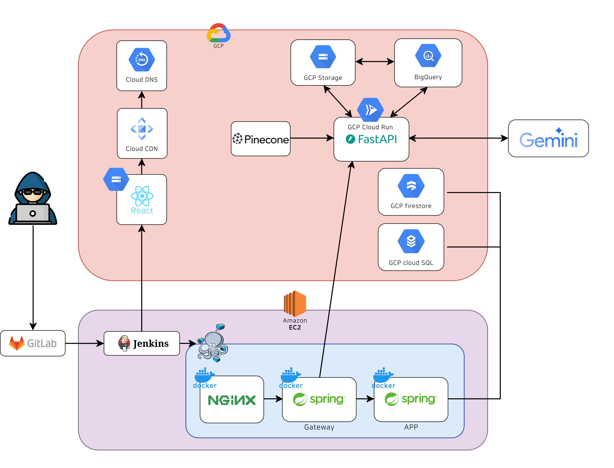

# 📊 LLM 기반 사내 데이터 분석 엔진, DBDeep

**구글 기업 연계 프로젝트**로 개발된 DBDeep은 자연어로 데이터에 질문하고, SQL 쿼리를 자동 생성·검증·실행하여 인사이트와 시각화를 즉시 제공하는 차세대 데이터 분석 플랫폼입니다.

누구나 손쉽게 데이터를 탐색하고, 시각화하며, 의사결정에 필요한 정보를 실시간으로 얻을 수 있도록 설계했습니다.

 

---

 

## 🚀 서비스 소개 + 주요 기능

DBDeep은 "데이터 민주화"를 목표로 비전문가도 직관적으로 사용할 수 있는 NL2SQL·NL2Chart 시스템을 제공합니다.

### 🔮 데이터 분석 엔진
  - 🌿 **NL2SQL**
    - 자연어 질의 → SQL 자동 생성 및 검증 → BigQuery에서 실시간 실행
    - 사용자의 질문을 이해하고 적절한 SQL 쿼리로 변환
    - Google BigQuery와 연동하여 실시간 데이터 조회
    - RAG(Retrieval-Augmented Generation) 기반으로 테이블/스키마 정보를 사전 검색하여 쿼리 정확도 향상
      - 사용자 질문과 가장 관련 있는 Top-K 테이블 설명을 LLM에 제공

  - 📊 **NL2Chart**
    - SQL 쿼리 결과를 시각화 차트로 변환
    - 분석 결과를 적합한 차트 유형으로 시각화하여 이해도를 높임

  - 📝 **인사이트 요약**
    - 차트 결과와 사용자 질의 의도를 기반으로 핵심 인사이트 제공

  - 🧠 **LLM 사고 과정 출력 CoT**
    - AI의 reasoning 과정을 실시간으로 확인

### 🧭 사용자 맞춤 질의 흐름 관리 (Proxy LLM)
- 질의 유형(`analysis`, `follow-up`, `confused`)을 분류하여 자연스러운 대화 흐름 유도
- 사용자 의도에 따라 응답을 맞춤 설계

### 🗄️ **질문 아카이빙**
  - 사용자의 자연어 질문, 생성된 SQL, 차트, 인사이트를 저장
  - 유사 질문 검색 및 재활용

### 🛠️ **사용자 용어 사전**
  - 사내에서 사용하는 비즈니스 용어를 정의하여 모델이 정확하게 이해할 수 있도록 지원
    - 예) `실적` → `총 매출` - `비용`
  - Custom Dictionary 기반 용어 정제 및 응답 보완

### 🔍 **실시간 검색 및 채팅**
  - 과거 대화 및 결과를 빠르게 찾아볼 수 있는 검색 기능

 

---

 

## 💻 기술 스택

| 구분 | 기술 |
|---|---|
| **Frontend** | React 19, TypeScript 5, Vite 6, Zustand, Redux Toolkit, React Query, Plotly.js |
| **Backend** | Spring Boot 3, Java 17, MySQL 8, Redis, Elasticsearch 7, FastAPI |
| **AI/LLM** | Gemini, HuggingFace, Langchain |
| **Infra** | Docker Compose, Nginx, Jenkins, AWS EC2, CloudSQL, Firestore |
| **DevOps** | GitLab, Jira, MatterMost |
| **Design** | Figma |

 

---

 

## 🏛️ 아키텍처

아래 이미지는 DBDeep의 전체 시스템 구성입니다.

<figcaption>^ DBDeep 아키텍처</figcaption>

<figcaption>^ DBDeep LLM 파이프라인</figcaption>

- **Frontend**: React + Vite SPA
- **API Gateway**: Spring Boot
- **LLM Engine**: FastAPI 서버
- **Elasticsearch**: 채팅 로그 저장 및 검색
- **Redis**: 세션 캐시
- **MySQL**: 사용자/프로젝트/질문 관리
- **Firestore**: Glossary 저장

 

---

 

## 🧩 주요 문제 + 해결방법

| 문제 | 해결방안 |
|---|---|
| **SQL 정확도** | 테이블 스키마와 용어 사전을 LLM에 RAG 방식으로 함께 전달해 문맥 이해도 개선 |
| **쿼리 실행 속도 저조** | BigQuery의 `SEARCH INDEX` 설정으로 쿼리 실행 속도 8m -> 2s 개선 |
| **답변 생성 속도 지연** | FastAPI 경량 서버로 LLM API 호출 분리, 프롬프트 최적화 |
| **11개 테이블 JOIN 복잡도** | 뷰(View) 생성과 Star Schema를 활용해 쿼리 복잡도 감소 |
| **웹소켓 연결 불안정** | 서버 재연결 로직 및 타임아웃 설정 보강 |
| **시각화 필요 유무 판단** | 응답 후 '시각화/해석하기' 선택 옵션 제공 |
| **AI 응답 신뢰도** | LLM reasoning 단계 콘솔 출력, 유저 피드백 기반 결과 개선 |

 

---

 

## 👥 팀원

| 프로필 | 이름 | 역할 | GitHub |
|:--:|:--|:--|:--|
|  | **이승우 (팀장)** | 백엔드 총괄, API 설계 | [@swoolee97](https://github.com/swoolee97) |
|  | **김지호** | 인프라 | [@kjh-0523](https://github.com/kjh-0523) |
|  | **오준수** | 실시간 채팅, LLM 통합 | [@DDuMandoo](https://github.com/DDuMandoo) |
|  | **임유진** | 프론트엔드, UI/UX, 채팅/아카이빙 화면 | [@imewuzin](https://github.com/imewuzin) |
|  | **박경완** | 마이데이터, 백엔드 | [@cup-wan](https://github.com/cup-wan) |
|  | **조예슬** | AI 파이프라인 설계 및 메인 알고리즘 구현, BigQuery 관리 | [@seul1230](https://github.com/seul1230) |

 

---

 

## 🧭 멘토링

본 프로젝트는 **구글 코리아**의 **박혜미 멘토님**과 6회에 걸쳐 밀착 멘토링을 진행했습니다.

- **데이터 스키마 전달 전략**
  - LLM에 스키마/비즈니스 용어를 효율적으로 전달하는 RAG 설계
- **쿼리 성능 개선**
  - Star Schema, 뷰 생성으로 JOIN 최적화
- **UX 피드백**
  - "데이터 민주화"를 실현할 수 있는 직관적 UI 제안
- **프로젝트 확장성**
  - NL2ML, Anomaly Detection, Agentic 시스템까지 확장 아이디어 공유

 

---

 

## 🏁 기대효과

- 데이터 전문가에 의존하지 않고 누구나 **실시간 데이터 인사이트** 획득
- 사내 데이터·용어 기반의 **맞춤형 분석 플랫폼**
- 반복적 보고서/쿼리 업무 **자동화 및 효율화**
- 데이터 기반 의사결정 **민주화**

 

---
 

> 🚀 **DBDeep으로 더 많은 조직이 데이터 중심 문화를 실현하길 바랍니다.**
